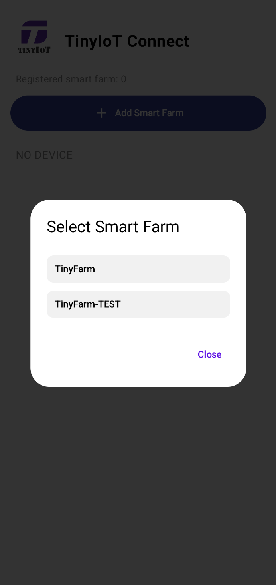
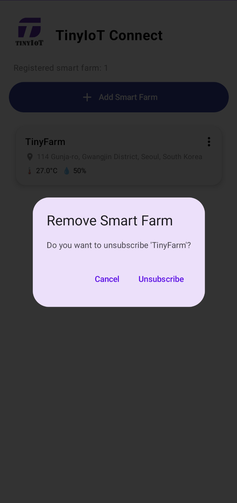
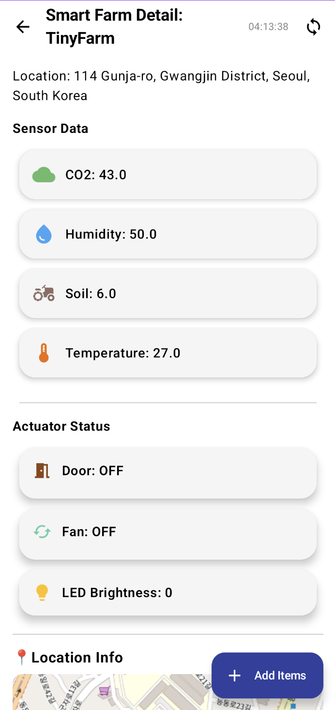
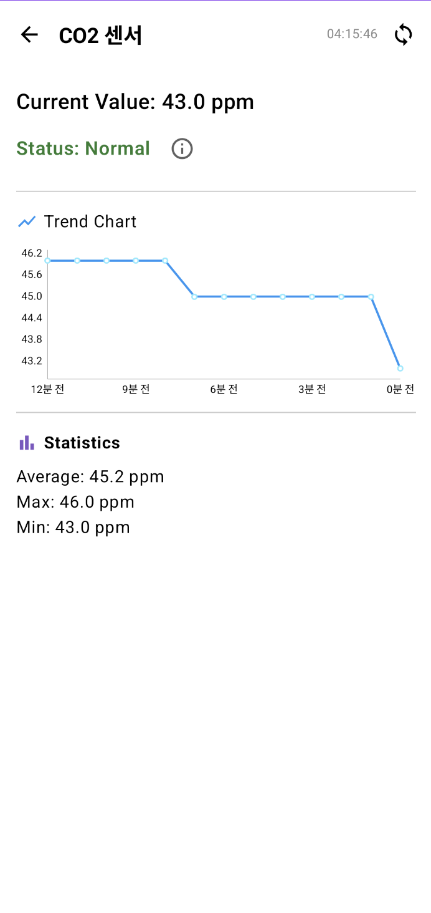
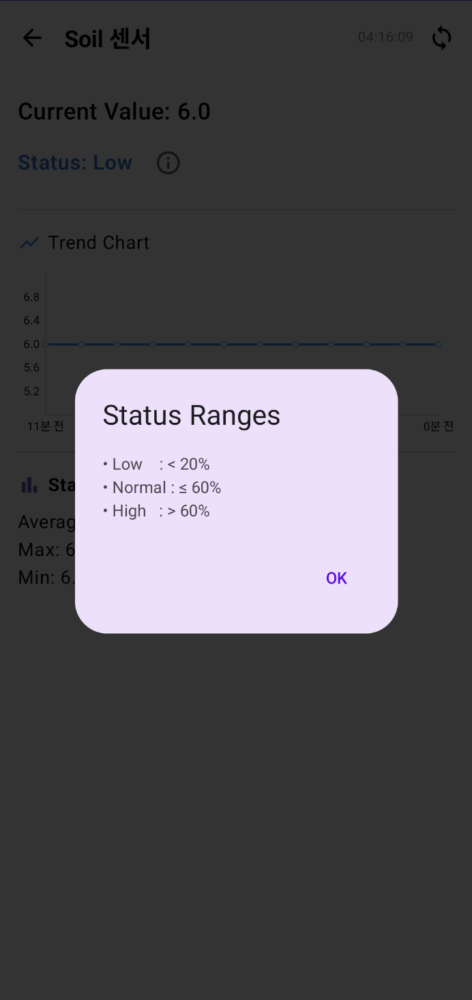
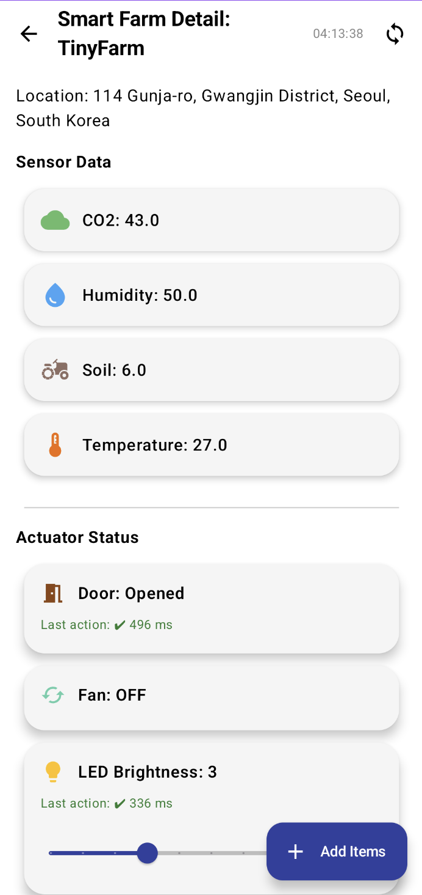
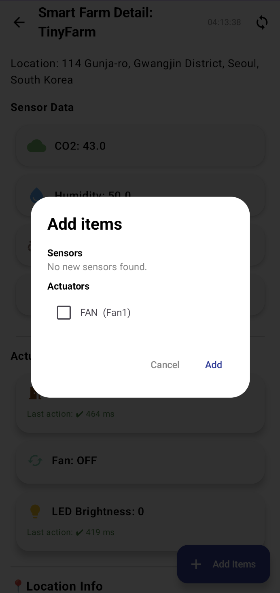
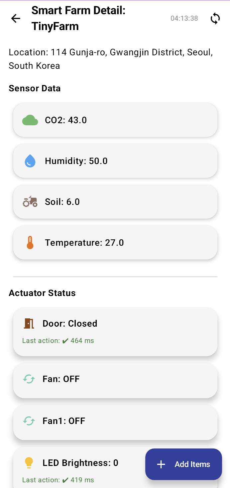
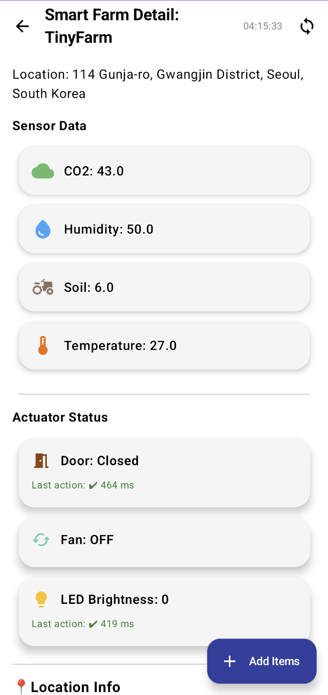

# TinyIoT Connect (Android, Compose)

스마트팜(AE)의 센서/액추에이터를 oneM2M(REST)로 모니터링/제어하는 안드로이드 앱.

센서 실시간 모니터링, 액추에이터 제어(지연시간 표시), 동적 디바이스/항목 추가를 지원합니다.

## 주요 기능	

- AE 등록/해제 (DataStore 기반)

- 센서/액추에이터 자동 발견: ty=3 우선, 없으면 ty=4에서 CNT명 추출(fallback)
- 센서 값 표시 & 추이 차트/통계
- 액추에이터 제어: Fan/Water 토글, Door Open/Close, LED 밝기 슬라이더
- 액션 지연시간 측정(POST~값 반영까지, Last action: ✔ 450 ms 등)
- Add Items: 서버의 CNT 생성(409=이미 존재는 OK) → DB/스토어 반영 → 최신값 1회 읽기 → 폴링 재시작
- Refresh: 서버 리소스 트리 재발견 → Room DB **replaceByTree()**로 치환 저장 → 화면 동기화


## 빠른 시작 

### 요구사항

- Android Studio Koala 이상

- JDK 17, Gradle(프로젝트에 포함)
- 테스트 서버 접근 가능(연구실 서버 또는 에뮬레이터용 로컬 프록시)

### 1) 클론 & 열기

```bash
$ git clone <YOUR_REPO_URL>

$ open in Android Studio

```

### 2) 서버 주소 설정

com.example.tiny2.network.TinyIoTApi.kt 상단:

```kotlin

// 에뮬레이터에서 로컬호스트 쓰려면: "http://10.0.2.2:3000"
```

### 3) 실행

- 앱 실행 → Add Smart Farm → 서버에서 AE 목록(TinyIoT?fu=1&ty=2) 로드 → 선택하여 등록
- 디테일 화면에서 센서/액추 상태 확인 및 제어

## 리소스 트리 개요 (oneM2M)


## 아키텍처 요약

- UI: Jetpack Compose

- 상태: ViewModel(DeviceMonitorViewModel) + StateFlow
- 영속화: Room(테이블 CntDefEntity) + DataStore(등록된 AE 목록)
- 네트워크: OkHttp (로그: NET_TIME, POST_RAW)
- 동기화 흐름
    1. fetchResourceTree(ae) → Room에 치환 저장(replaceByTree)
    
    1. VM start()로 폴링 시작 → 값 수신 시 UI 반영
    1. Add Items 시 서버 CNT 생성 → DB upsert → 최신값 1회 읽기 → VM 재시작/force refresh

## 사용법 요약

### 메인


- Add Smart Farm: AE 목록 가져와 선택 → 카드 생성




- 카드 ⋮ → Unsubscribe: DataStore에서 제거





### Detail

- Refresh(오른쪽 상단 아이콘): 서버 기준 트리 재발견 → DB 치환 → 폴링 재시작



- Sensor Data: 카드 탭 → 차트/통계
    - 현재 상태 옆 아이콘 클릭 시 범위 표시





- Actuator Status
    - Fan/Water: 카드 탭으로 ON/OFF

    - Door: Opened/Closed 토글
    - LED: 슬라이더(0~10)
    - 하단 라벨에 Last action(지연시간/타임아웃) 표시




### Add Items

1. FAB Add Items → 서버 CNT 전체 스캔(이미 존재하는 항목 제외)



2. 선택 → 서버에 CNT 생성 + 초기 CIN 시드 → DB 반영 → 최신값 읽기 → 폴링 재시작

3. 즉시 카드가 생기고, 상태/값이 채워짐




4. Sensor/Actuator cnt 삭제 시 카드도 삭제됨



## 주요 설정 / 코드 포인트

- 서버 BASE: TinyIoTApi.kt → BASE

- Actuators 경로: 반드시 Actuators(복수형)
- 발견 로직:
    - 함수: getCntNamesWithFallback(basePath)

    - ty=3 비어있으면 ty=4에서 CNT명 추출
- 지연시간 측정:
    - sendActuatorWithLatency()

    - 로그 태그: ACT_MEASURE (POST 소요, 폴링, 매칭/타임아웃)
- DB 치환 저장:
    - CntRepository.replaceByTree(ae, tree) → deleteByAe(ae) 후 upsertAll(defs)
- UI 동기화 핵심 로그 태그
    - ADD_ITEMS, TREE_URIS, POST_RAW, ACT_MEASURE, NET_TIME

## 수동 검증 시나리오

1. 메인에서 AE 등록 → 카드 생성

1. 디테일 진입 → 센서 카드 보임
1. Add Items로 LED/Fan 추가 → 즉시 카드 등장 + 값 채워짐
1. LED 슬라이더 조절 → “Last action: ✔ n ms” 표시
1. 서버에서 CNT 삭제 후 디테일 상단 Refresh → 카드가 사라짐(서버 기준 반영)

## 트러블슈팅

- 액추에이터가 안 보임 → 서버가 ty=3을 비워두는 케이스. 앱은 ty=4 fallback으로 보완함.
  (로그 TREE_URIS path=...ty=3 -> size=0, 이어서 ty=4 성공 확인)
- Add Items 후 카드가 안 보임 → DB 반영/트리 재시작 루틴 확인 (ADD_ITEMS 로그, forceRefreshOnce)

- NetworkOnMainThreadException → 모든 네트워크는 Dispatchers.IO/enqueue 사용(앱은 이미 분리되어 있음)

## 빌드

- Debug : Android Studio ▶︎ run

- CLI: 
```bash
$ ./gradlew assembleDebug
``` 
